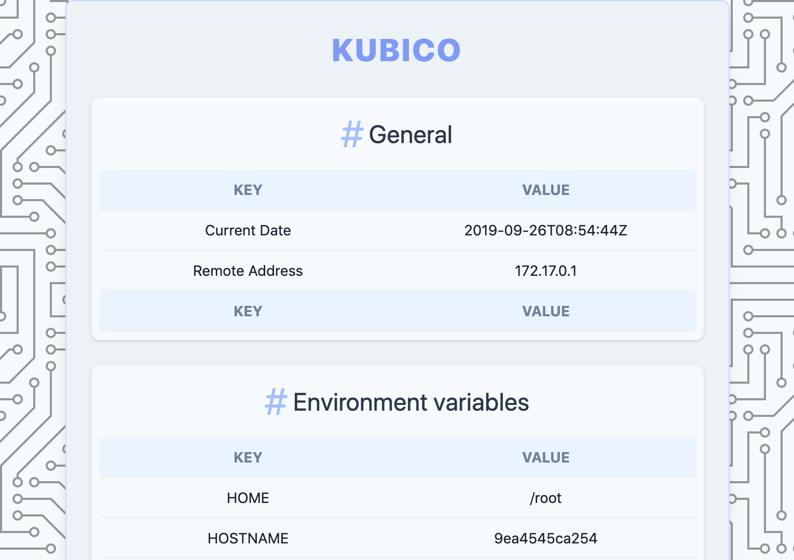

# Kubico

<div align="center">
  
</div>

## How to use/build

Requirements:
- [Docker](https://docs.docker.com/install/)
- [Task](https://taskfile.dev/#/installation) A Task runner)

## Task commands

Available [Task](https://taskfile.dev/#/) commands:

```
* build:              Build the web app
* cleanup:            Cleanup workspace
* run:                Build and run the web app
* d:build:            Build docker container
* d:lint:             Apply a Dockerfile linter (https://github.com/hadolint/hadolint)
* d:run:              Run the container
* node:dev:           Run "npm run development"
* node:install:       Run "npm install"
* node:prd:           Run "npm run production"
* node:shell:         Opens up "assets"-dir in a container with NodeJS
* node:update:        Run "npm update"
```
